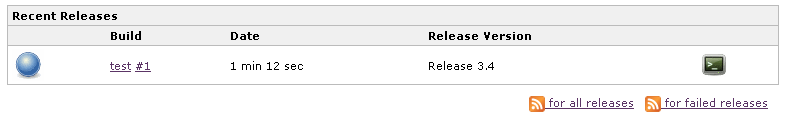

# Release 

This plugin adds the ability to wrap your job with pre- and post- build
steps which are only executed when a manual release build is triggered.

Additional plugin integration

Supports the [Dashboard
View](https://plugins.jenkins.io/dashboard-view/) with the
Recent Releases portlet and the [Promoted Builds
Plugin](https://plugins.jenkins.io/promoted-builds/)
with the Release build condition.

# Configure the job to enable releasing

On the job configuration page, enable the release build configuration
under the Build Wrapper heading and add your required release version
template string, release
[parameters](https://plugins.jenkins.io/parameterized-trigger/),
pre and post build steps that you need to complete a release.

### Release Version Template

The release version template was added in version 1.7 of the release
plugin.  This parameter lets you define how the release plugin
identifies the release of the project.  This is done by building a
parameter based template which is resolved at release time to a fully
resolved string.  For instance, the template can be: Release:
${releaseVersion}.  This will instruct the release plugin to use the
value of the parameter name releaseVersion to come up with the fully
identifying string which will then be used as a description of the
release build and as a tooltip on the release build icon on the
historical build list.

### Release Parameters

The release parameters let you define various parameters that are
presented to the user when a release is requested.  The list of
available parameter types are the same as those available in the
parameterized build option for Jenkins.

### Build Steps

The build steps section is used to define arbitrary actions to run
before and after the standard job build steps run. These are the same
build steps offered as the build steps available in the free style job
type.

In my experience, a release build typically requires pre-build steps of
validating the project is releasable and bumping the version to the
release version. After the build runs as usual, the post build steps are
labeling the codebase and bumping the version to the next development
version.

# Executing a release

To run a release, click the Release icon from the job home page. This
will bring you to the release details page where you will be prompted to
fill in any parameters that you have defined (or the default
RELEASE\_VERSION and DEVELOPMENT\_VERSION if there were no parameters
defined).  As seen above, these values are then available at job
execution time in both the pre and post release steps as well as the
normal build steps. Finally, click the schedule release build and the
job is scheduled to run immediately, now including the execution of the
pre and post build steps.

# Viewing results

Once the build is complete, the release plugin automatically locks the
build, preventing it from being automatically deleted and adds a release
icon denoting it as a release build.

# Supported Job Types

 The release plugin supports the Maven2 and Free Style Job type

# Recent Releases Portlet

The release plugin contributes a recent releases portlet that can be
used in a [Dashboard
View](https://plugins.jenkins.io/dashboard-view/). 

This portlet shows the 5 most recent release builds in normal mode with
a link that brings you to the build page and the version string.
  
In the maximized mode, it shows the 50 most recent builds with
additional detail.  Additionally, it offers an rss feed while in the
maximized mode so that you can get notified of all release builds or all
failing release builds.

